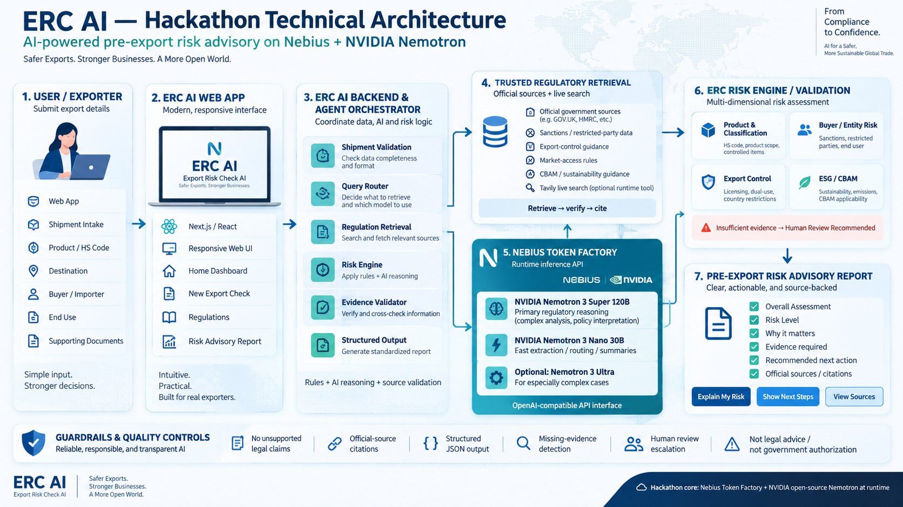

# ERC AI — Export Risk Check AI

**Identify risks before you ship.**

ERC AI is an AI-powered pre-export risk advisory application designed for exporters and SMEs who already have buyers.

It helps users identify potential regulatory and compliance risks before shipment and transforms complex trade requirements into clear, actionable next steps.

---

## The Problem

Exporters often need to navigate fragmented and rapidly changing regulatory requirements across multiple jurisdictions.

Before shipment, they may need to review:

- Product classification and HS code issues
- Buyer / restricted-party risks
- Export control requirements
- Destination-market regulations
- Tariff and trade-remedy considerations
- Sustainability requirements such as CBAM
- Supply-chain and due-diligence obligations

For SMEs without dedicated compliance teams, this process can be complex, time-consuming, and difficult to interpret.

---

## The Solution

ERC AI provides a structured pre-export risk check.

Users enter:

- Product
- HS Code
- Exporting country
- Destination country
- Buyer / Importer
- End use
- Product origin
- Supply-chain information
- Supporting documents

ERC AI is designed to generate a:

## Pre-Export Risk Advisory Report

including:

- Overall Risk Assessment
- Product & Classification Risk
- Buyer / Entity Risk
- Export Control Risk
- Import & Market Access Requirements
- Sustainability / CBAM Considerations
- Missing Evidence
- Recommended Next Actions
- Official Regulatory Sources

---

## Core Principle

ERC AI follows:

**Evidence → Reasoning → Risk → Action**

If available evidence is insufficient, the system should return:

**Insufficient Evidence — Human Review Recommended**

---

## Current MVP

The current web MVP includes:

- Home Dashboard
- Shipment Intake
- Shipment Review
- Pre-Export Risk Advisory Report
- Regulations interface
- Evidence checklist
- Recommended next actions
- Responsive desktop and mobile UI

The current build uses mock risk-analysis data while the real AI and regulatory retrieval layers are being integrated.

---

## Technical Architecture

ERC AI is being developed for the **Nebius x NVIDIA Global AI Hackathon 2026**.

Planned AI stack:

- Nebius Token Factory
- NVIDIA Nemotron
- Structured AI outputs
- Regulatory retrieval
- Risk validation
- Official-source citations
---

## Initial Risk Modules

1. Product & Classification
2. Buyer / Entity Risk
3. Export Control
4. Import & Market Access
5. Tariff & Trade Remedy
6. ESG / Sustainability
7. Forced Labour / Due Diligence

Hackathon MVP focus:

- Product / Classification
- Buyer / Entity Risk
- Export Control
- Sustainability / CBAM

---

## Example Use Case

- Product: Aluminum profiles
- HS Code: 7604.10
- Exporting country: Taiwan
- Destination: United Kingdom
- Buyer: UK Building Solutions Ltd.
- End use: Building and construction

---

## Technology

Frontend:

- Next.js
- React
- TypeScript
- Tailwind CSS

AI / Backend:

- Nebius Token Factory
- NVIDIA Nemotron
- Structured JSON output
- Regulatory retrieval layer

---

## Project Status

**MVP under active development**

Completed:

- Functional frontend workflow
- Shipment Intake
- Review workflow
- Mock Risk Advisory Report
- Regulations interface
- Responsive UI

In progress:

- Nebius / Nemotron integration
- Live regulatory retrieval
- Structured AI risk reasoning
- Official-source citations
- Risk validation

---
## Current Development Status — 19 September 2026

ERC AI is currently under active development for the Nebius x NVIDIA Global AI Hackathon 2026.

* Working responsive prototype completed
* RiskReport v1 schema implemented
* Dynamic jurisdiction-aware regulatory source architecture completed
* Evidence and source validation completed
* ERC AI system prompt completed
* AI provider abstraction completed
* Server-side AI architecture and security boundary implemented
* Nebius Token Factory integration in progress
* Current runtime remains **MOCK** until the live Nebius Token Factory integration is enabled

The current prototype is designed so that deterministic regulatory checks, official-source evidence, AI reasoning, and structured risk reporting remain separated and auditable.
---

## Disclaimer

ERC AI provides risk-assessment and regulatory guidance only.

It does not constitute legal advice, customs clearance, export authorization, or an official government determination.

---

## Project Lead

**Elena Ya Ling Chen**

Founder & Project Lead  
ERC AI — Export Risk Check AI

GitHub: `elena-ercai`

---

## Hackathon

Built for the **Nebius x NVIDIA Global AI Hackathon 2026**.
